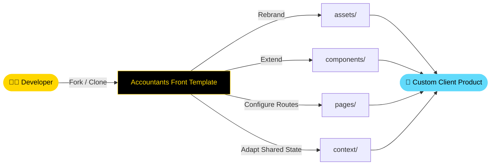

<div align="center">


[](https://git.io/typing-svg)

<br/>

<p align="center">
  <a href="https://github.com/NietoDeveloper">
    
  </a>
  <a href="https://committers.top/colombia#NietoDeveloper">
    
  </a>
  <a href="https://react.dev/">
    
  </a>
  <a href="https://reactrouter.com/en/main">
    
  </a>
  <a href="https://axios-http.com/">
    
  </a>
  <a href="https://opensource.org/licenses/MIT">
    
  </a>
</p>

<p align="center">
  <a href="https://accountantsla.vercel.app/">
    
  </a>
  <a href="https://github.com/NietoDeveloper/Accountants-Front">
    
  </a>
</p>

</div>

---

## 📋 About The Project

**Accountants Front** is a reusable, production-minded **React front-end template** built to be customized. Rather than a one-off client build, this repository is designed as a foundation: developers can fork it and adapt it to offer their own services or products across virtually any industry vertical — accounting, consulting, healthcare, retail, or beyond.

The template ships with a clean routing setup, a Context API layer for shared state, and an Axios-ready service layer, so the heavy scaffolding is already handled — leaving the developer free to focus on branding, content, and business logic.

Developed by **Manuel Nieto** (**NietoDeveloper**), ranked **#1 in Colombia** and **#3 in Latin America** on `committers.top`.

---

## 🗂️ Project Structure

```text
Accountants-Front/
├── public/           # Static public assets
└── src/
    ├── assets/        # Images, icons, and static resources
    ├── components/    # Reusable UI components
    ├── context/        # React Context providers for shared state
    └── pages/          # Route-level view components
```

---

## 🔄 Template Customization Flow



---

## 🛠️ Built With

<div align="center">

| Layer | Technologies |
|:------|:-------------|
| 🎨 **Frontend** | [React](https://react.dev/) |
| 🧭 **Routing** | [React Router DOM](https://reactrouter.com/en/main) |
| 🌐 **HTTP Client** | [Axios](https://axios-http.com/) |
| 🧠 **State Management** | React Context API |
| 💅 **Styling** | Bring your own — Tailwind CSS, Styled Components, or Material-UI |

</div>

---

## 🚀 Getting Started

### Prerequisites

- [Node.js](https://nodejs.org/) with npm, or [Yarn](https://classic.yarnpkg.com/lang/en/docs/install/)
- [Git](https://git-scm.com/downloads)

### Installation & Execution

**Step 1 — Clone the repository**

```bash
git clone https://github.com/NietoDeveloper/Accountants-Front
cd Accountants-Front
```

**Step 2 — Install dependencies**

```bash
npm install
```

**Step 3 — Run the development server**

```bash
npm run dev
```

Open your browser and navigate to the local URL shown in your terminal (typically `http://localhost:5173`).

---

## 🧩 Usage

This template is meant to be **adapted, not used as-is**:

- **Rebrand the identity:** Swap logos, colors, and copy in `src/assets/` and `src/pages/`.
- **Extend the routes:** Add or remove pages under `src/pages/` and register them in your router.
- **Wire your API:** Point the Axios service layer at your backend endpoints.
- **Reuse the components:** Compose new views from the shared building blocks in `src/components/`.

---

## 👨‍💻 Author

**Manuel Nieto (NietoDeveloper)**
Role: Full-Stack Software Engineer & Systems Architect
Location: Bogotá, Colombia
Rankings: #1 in Colombia & #3 in Latin America (committers.top)
Portfolio: [manuelnieto.netlify.app](https://manuelnieto.netlify.app)
GitHub: [@NietoDeveloper](https://github.com/NietoDeveloper)

---

## 📄 License

This project is licensed under the **MIT License**.

<div align="center">

<br/>


</div>
